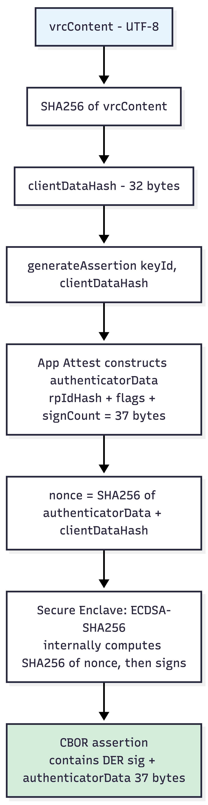
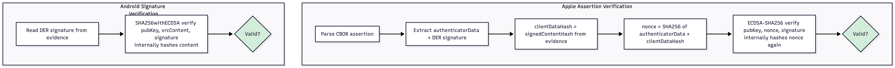

# VRC Native Crypto Reference

Platform-level cryptographic signing, verification, and certificate chain APIs for VRC hardware attestation.

**Related docs:**
- [VRC Signing Flow](./VRC_SIGNING_FLOW.md) — end-to-end signing and credential exchange
- [Verification Levels](./VRC_VERIFICATION_LEVELS.md) — what gets verified at each layer

---

## Quick Reference: Encoding Formats

| Format | Description | Where it appears |
|--------|-------------|------------------|
| **DER** | Binary ASN.1 encoding of X.509 certificates | `x5c` array inside CBOR attestation objects; Android KeyStore output |
| **PEM** | Base64-encoded DER with `-----BEGIN/END CERTIFICATE-----` headers | Stored in Keychain, Credo repository, and evidence blocks |
| **CBOR** | Compact binary structured data (binary JSON) | iOS App Attest attestation and assertion objects |
| **X.509** | Certificate standard (subject, issuer, public key, validity, extensions, signature) | Every certificate in the chain; DER and PEM are encoding variants |

---

## iOS Signing Flow

iOS uses Apple App Attest which follows WebAuthn conventions. The Secure Enclave signs via ECDSA-SHA256, and App Attest wraps the result in a CBOR assertion containing authenticator metadata.



**Effective signature covers:**
```
ECDSA_sign( SHA256( SHA256( authenticatorData || SHA256(vrcContent) ) ) )
```

The "double hash" is an emergent property of two independent layers:
1. **WebAuthn protocol** — hashes the payload into a nonce
2. **ECDSA-SHA256 algorithm** — hashes its input before signing

Neither layer is aware of the other.

---

## Android Signing Flow

Android signs directly with `SHA256withECDSA` — no CBOR wrapping or authenticator metadata.

**Effective signature covers:**
```
ECDSA_sign( SHA256(vrcContent) )
```

---

## iOS Signature Verification

### SecKey Algorithm Variants

| Constant | Behavior | Use when |
|----------|----------|----------|
| `kSecKeyAlgorithmECDSASignatureMessageX962SHA256` | Hashes input, then verifies ECDSA | Input is the **message** (not pre-hashed) |
| `kSecKeyAlgorithmECDSASignatureDigestX962SHA256` | Verifies ECDSA on input **as-is** | Input is already a SHA256 digest |

For App Attest assertion verification, use the **Message** variant — it internally hashes `nonce` → `SHA256(nonce)`, matching what the Secure Enclave signed.

### API — Verifying an Apple assertion

```objc
SecKeyVerifySignature(pubKey,
    kSecKeyAlgorithmECDSASignatureMessageX962SHA256,
    (__bridge CFDataRef)nonce,
    (__bridge CFDataRef)signature, NULL);
```

### API — Verifying an Android signature (on iOS)

```objc
SecKeyVerifySignature(pubKey,
    kSecKeyAlgorithmECDSASignatureMessageX962SHA256,
    (__bridge CFDataRef)contentData,
    (__bridge CFDataRef)signature, NULL);
```

---

## Android Signature Verification

### API — Verifying an Apple assertion

```kotlin
val sig = Signature.getInstance("SHA256withECDSA")
sig.initVerify(pubKey)
sig.update(nonce)          // nonce = SHA256(authData || clientDataHash)
sig.verify(derSignature)
```

### API — Verifying an Android signature

```kotlin
val sig = Signature.getInstance("SHA256withECDSA")
sig.initVerify(pubKey)
sig.update(contentBytes)   // raw VRC content
sig.verify(signatureBytes)
```

---

## Assertion Verification Flow



---

## Certificate Chain Verification APIs

| | iOS | Android |
|---|---|---|
| **Framework** | Security.framework (`SecTrust*`) | Java Security (`CertPathValidator`) |
| **Standard** | X.509 / RFC 5280 | X.509 / RFC 5280 / PKIX |
| **Create policy** | `SecPolicyCreateBasicX509()` | `CertPathValidator.getInstance("PKIX")` |
| **Build chain** | `SecTrustCreateWithCertificates()` | `CertificateFactory.generateCertPath()` |
| **Pin roots** | `SecTrustSetAnchorCertificates()` + `SetAnchorCertificatesOnly(YES)` | `PKIXParameters(trustAnchors)` |
| **Validate** | `SecTrustEvaluateWithError()` | `CertPathValidator.validate()` |
| **Revocation** | Not used | Disabled in PKIX; checked separately via Google CRL |

### Checks performed by both APIs

| Check | Description |
|-------|-------------|
| Signature chaining | Leaf signed by intermediate key, intermediate signed by root key |
| Validity dates | Each cert: `notBefore` ≤ now ≤ `notAfter` |
| Basic constraints | Intermediate = `CA:TRUE`, leaf = `CA:FALSE` |
| Key usage | Signing certs have `digitalSignature` bit |
| Trust anchor | Chain terminates at a pinned root CA |

### iOS API example

```objc
SecPolicyRef policy = SecPolicyCreateBasicX509();
SecTrustRef trust = NULL;
SecTrustCreateWithCertificates(certRefs, policy, &trust);
SecTrustSetAnchorCertificates(trust, rootCAs);
SecTrustSetAnchorCertificatesOnly(trust, YES);
BOOL valid = SecTrustEvaluateWithError(trust, &error);
```

### Android API example

```kotlin
val certFactory = CertificateFactory.getInstance("X.509")
val certs = pems.map { certFactory.generateCertificate(it.byteStream()) as X509Certificate }
val trustAnchors = setOf(TrustAnchor(googleRootCert, null))
val certPath = certFactory.generateCertPath(certs.dropLast(1))
val validator = CertPathValidator.getInstance("PKIX")
val params = PKIXParameters(trustAnchors).apply { isRevocationEnabled = false }
validator.validate(certPath, params)
```

---

## Certificate Chain Structure

### iOS App Attest (2 certs)

```
[0] Leaf — device-specific, EC P-256, validity ~72h
    Issuer: Apple App Attestation CA 1
    Extension: 1.2.840.113635.100.8.2 (App Attest nonce)

[1] Intermediate — Apple App Attestation CA 1, EC P-384, validity ~10y
    Issuer: Apple Root CA - G3
```

### Android Key Attestation (3–4 certs)

```
[0] Leaf — CN=Android Keystore Key, EC P-256, validity ~30y
    Issuer: varies by manufacturer
    Extension: 1.3.6.1.4.1.11129.2.1.17 (Key Attestation)
      → security level, verified boot state, user auth type

[1] Intermediate — device manufacturer CA
    Issuer: Google Hardware Attestation Root

[2] Root — sometimes included in chain (self-signed)
```

### Embedded Root CAs

These are hardcoded in the app (not from the system trust store), preventing a compromised device from injecting a fake root.

| Root CA | Platform | Embedded in | Expiry |
|---------|----------|-------------|--------|
| Apple App Attestation Root CA | iOS | `Attestation.mm`, `AttestationModule.kt` | 2036 |
| Apple Root CA - G3 | iOS (backup anchor) | `Attestation.mm`, `AttestationModule.kt` | 2039 |
| Google Hardware Attestation Root | Android | `Attestation.mm`, `AttestationModule.kt` | 2026-05-24 |

---

## CBOR Structures

### Attestation Object (iOS, from `attestKey:`)

```json
{
  "fmt": "apple-appattest",
  "attStmt": {
    "x5c": [
      "<DER leaf certificate>",
      "<DER intermediate certificate>"
    ],
    "receipt": "<opaque bytes>"
  },
  "authData": "<37+ bytes of authenticator data>"
}
```

The `x5c` entries are DER-encoded X.509 certificates. Each is converted to PEM via `derToPem()`.

### Assertion Object (iOS, from `generateAssertion:`)

```json
{
  "signature": "<DER ECDSA signature, ~71 bytes>",
  "authenticatorData": "<37 bytes>"
}
```

The entire CBOR-encoded assertion is base64-encoded and placed in `evidence.signature.value`.

### authenticatorData layout

| Bytes | Field | Value |
|-------|-------|-------|
| 0–31 | `rpIdHash` | `SHA256(TeamID + "." + BundleID)` |
| 32 | `flags` | `0x05` = user present + user verified (biometric passed) |
| 33–36 | `signCount` | Big-endian uint32, increments per signature |

---

## Format Summary by Platform

```
iOS Attestation:   attestKey() → CBOR → x5c[DER, DER] → derToPem() → PEM strings
iOS Assertion:     generateAssertion() → CBOR → base64 → evidence.signature.value
Android Attestation: KeyStore.getCertificateChain() → DER → PEM strings
Android Signing:     Signature.sign() → DER → base64 → evidence.signature.value
```
