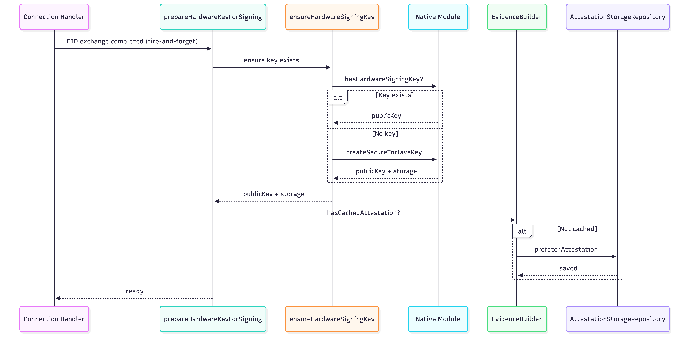
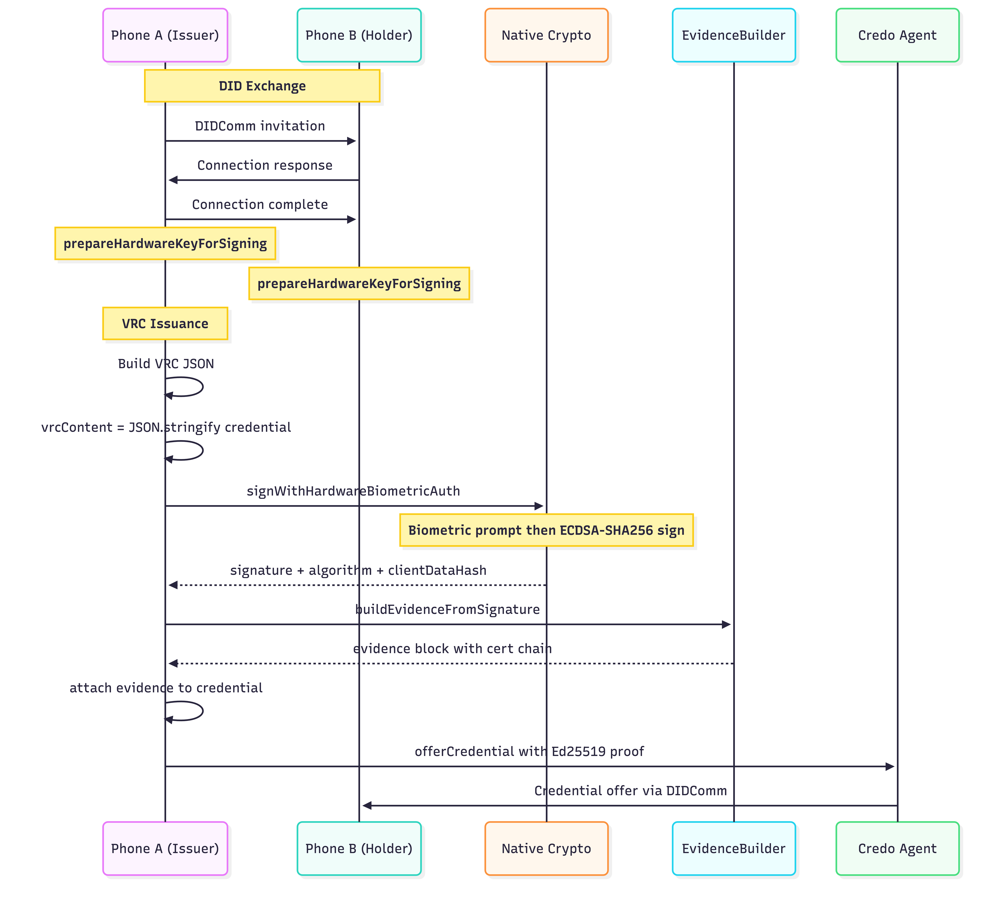

# VRC Hardware Signing Flow

Verifiable Relationship Credentials (VRCs) are signed with hardware-backed keys (Secure Enclave on iOS, StrongBox/TEE on Android) to prove that a real device with biometric authentication issued the credential.

**Related docs:**
- [Native Crypto Details](./VRC_NATIVE_CRYPTO.md) — platform-specific APIs, key formats, and certificate handling
- [Verification Levels](./VRC_VERIFICATION_LEVELS.md) — what gets verified and at which layer

---

## Key Setup

Keys are created **lazily** — not at app startup, but when a VRC connection completes.

- **Primary path:** `prepareHardwareKeyForSigning(agent)` is called fire-and-forget when a DID exchange reaches `Completed` state. This front-loads key creation and Apple/Google server calls so later signing only needs a biometric prompt.
- **Fallback path:** `ensureHardwareSigningKey(agent)` is called at the start of `signVrcWithHardwareKey()` if the key doesn't exist yet.



---

## Storage

| Data | Location | Key / ID |
|------|----------|----------|
| Key ID (private key handle) | iOS Keychain | `{bundleID}.AttestationKey` |
| Public key (65-byte EC point) | iOS Keychain | `{bundleID}.AppAttestPublicKey` |
| Certificate chain (PEM) | iOS Keychain | `{bundleID}.AppAttestCertChain` |
| Signing key pair | Android KeyStore | `biometric_signing_key_v2` |
| Attestation cache | Credo/Askar wallet DB | `AttestationStorageRecord` |

**`AttestationStorageRecord` fields:**

| Field | Type | Purpose |
|-------|------|---------|
| `publicKeyHash` | string | Lookup tag (djb2 hash + key prefix) |
| `publicKey` | string (base64) | EC P-256 public key |
| `certificateChain` | string[] (PEM) | Leaf → intermediate certs from Apple/Google |
| `format` | enum | `apple-appattest-v1` or `android-key-attestation-v3` |
| `platform` | enum | `ios` or `android` |
| `securityLevel` | enum | `SecureEnclave`, `StrongBox`, `TEE`, `Software`, `Unknown` |
| `attestedAt` | ISO 8601 | When the attestation was fetched |
| `expiresAt` | ISO 8601 | Expiry (iOS certs ~72h) |

---

## Signing Flow



### Platform differences

| | iOS | Android |
|---|-----|---------|
| **Key hardware** | Secure Enclave | StrongBox or TEE |
| **Biometric** | Face ID / Touch ID | Fingerprint |
| **Signing input** | SHA256(vrcBytes) passed to `generateAssertion` | Raw vrcBytes passed to `Signature.sign()` |
| **Signature output** | CBOR assertion (~110 bytes) containing authenticatorData + DER sig | Raw DER ECDSA signature (~71 bytes) |
| **`clientDataHash`** | Included (SHA256 of VRC content) | Not applicable |
| **Attestation format** | `apple-appattest-v1` | `android-key-attestation-v3` |

---

## Evidence Block

The evidence block follows the W3C VC Data Model `evidence` field. It is attached to the credential before the DIDComm offer.

```json
{
  "id": "urn:uuid:...",
  "type": ["BiometricAttestation", "HardwareKeyAttestation"],
  "created": "2026-03-06T00:20:56.000Z",
  "biometricMethod": {
    "type": "FaceID",
    "authenticatorType": "platform",
    "userVerification": "required"
  },
  "hardwareBinding": {
    "keyStorage": "SecureEnclave",
    "platform": "ios",
    "keyType": "EC-P256",
    "algorithm": "ECDSA-SHA256",
    "publicKey": "<base64 EC P-256 public key>"
  },
  "attestation": {
    "format": "apple-appattest-v1",
    "certificateChain": ["-----BEGIN CERTIFICATE-----\n...", "..."]
  },
  "signature": {
    "value": "<base64 signature>",
    "algorithm": "ECDSA-SHA256",
    "signedContentHash": "<base64 SHA256 of VRC JSON>"
  }
}
```

| Field | Description |
|-------|-------------|
| `hardwareBinding.publicKey` | Must match the public key in the leaf certificate |
| `attestation.certificateChain` | PEM X.509 certs — verifier validates the chain back to Apple/Google root |
| `signature.value` | iOS: full CBOR assertion; Android: raw DER ECDSA signature |
| `signature.signedContentHash` | SHA256 of the VRC JSON at signing time; used for cross-device verification |

---

## Cross-Platform Verification Matrix

The receiver's `BiometricSignatureVerifier` delegates all crypto to native code. It branches on `attestation.format`:

| Sender | Receiver | Signature format | Verification path |
|--------|----------|-----------------|-------------------|
| iOS | iOS | CBOR assertion | Parse CBOR → extract nonce → ECDSA verify |
| iOS | Android | CBOR assertion | Parse CBOR → extract nonce → SHA256withECDSA verify |
| Android | iOS | Raw DER | Direct ECDSA verify against VRC content |
| Android | Android | Raw DER | Direct SHA256withECDSA verify against VRC content |

All four combinations perform the same three-step verification:
1. **Certificate chain** — is this key from real hardware?
2. **Public key match** — does the evidence key match the leaf cert?
3. **Signature verify** — was this VRC signed by that key?

---

## File Map

| Responsibility | Source file |
|---------------|------------|
| Key creation, signing orchestration | `packages/core/src/modules/vrc/vrc-hardware-signing.ts` |
| Biometric UI + hardware signing with retry | `packages/core/src/modules/vrc/vrc-biometric.ts` |
| Evidence block construction | `packages/core/src/modules/vrc/services/EvidenceBuilder.ts` |
| Evidence + signature verification | `packages/core/src/modules/vrc/services/BiometricSignatureVerifier.ts` |
| Evidence TypeScript types | `packages/core/src/modules/vrc/types/evidence.ts` |
| Attestation cache (Credo record) | `packages/core/src/modules/vrc/services/AttestationStorageRecord.ts` |
| Attestation cache (repository) | `packages/core/src/modules/vrc/services/AttestationStorageRepository.ts` |
| VRC lifecycle orchestrator | `packages/core/src/modules/vrc/vrc-manager.ts` |
| iOS native crypto | `packages/react-native-attestation/ios/Attestation.mm` |
| Android native crypto | `packages/react-native-attestation/android/.../AttestationModule.kt` |
| React Native bridge types | `packages/react-native-attestation/src/index.ts` |
