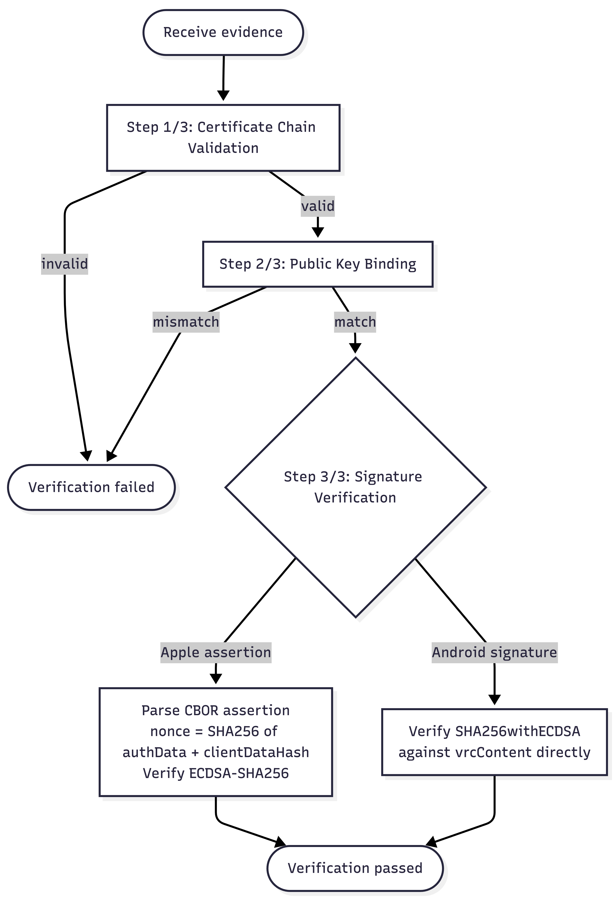
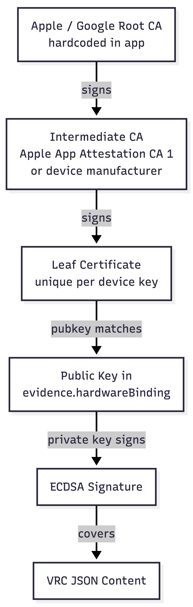

# VRC Verification Levels

What gets verified, by whom, at which layer, and using which APIs.

**Related docs:**
- [VRC Signing Flow](./VRC_SIGNING_FLOW.md) — end-to-end signing and sending process
- [Native Crypto Details](./VRC_NATIVE_CRYPTO.md) — CBOR, PEM, DER, ECDSA, platform APIs

---

## Overview

When Phone B receives a VRC from Phone A, the credential passes through four independent verification layers before it is trusted.

| Layer | What it proves | Who runs it |
|-------|---------------|-------------|
| 1 — DIDComm Transport | Message came from the connected DID | Credo-ts (automatic) |
| 2 — W3C Credential | Credential was signed by the claimed issuer DID | Credo-ts W3C module (automatic) |
| 3 — Hardware Evidence | A real hardware chip on a real device signed this VRC | Native code (`verifyBiometricEvidence`) |
| 4 — Android Extensions | Device hasn't been compromised or revoked | Android native code (Android only) |

---

## Layer 1 — DIDComm Transport

Credo-ts handles this automatically on receipt of any DIDComm message. The framework decrypts the DIDComm v2 envelope, confirms both parties completed DID exchange, and validates that the credential offer/request/issue sequence follows the Aries RFC 0453 protocol. No custom code is needed — if these checks fail, the message is rejected before it reaches our credential handler.

| Check | What it verifies | API |
|-------|-----------------|-----|
| Envelope authentication | Message encrypted to our DID and signed by sender's DID | Credo-ts DIDComm v2 |
| Connection state | Both parties completed DID exchange | Credo-ts connection module |
| Protocol compliance | Credential exchange follows Aries RFC 0453 | Credo-ts credential module |

---

## Layer 2 — W3C Credential

During `credentialReceived` processing, Credo-ts validates the JSON-LD structure, resolves the issuer's `did:peer`, and verifies the `Ed25519Signature2018` proof block. This is the **DID-level signature** — it proves the credential was issued by a specific DID. It is entirely separate from the ECDSA hardware signature in the `evidence` block (Layer 3).

| Check | What it verifies | API |
|-------|-----------------|-----|
| JSON-LD structure | `@context`, `type`, required fields present | Credo-ts JSON-LD processor |
| Proof verification | `Ed25519Signature2018` proof valid for issuer DID | Credo-ts signature suite |
| Issuer DID resolution | Issuer's `did:peer` resolves with the correct signing key | Credo-ts DID resolver |

**Proof block example:**

```json
{
  "proof": {
    "type": "Ed25519Signature2018",
    "verificationMethod": "did:peer:0z6Mkv1q...#key-1",
    "proofPurpose": "assertionMethod",
    "jws": "eyJhbGciOiJFZERTQSIs..."
  }
}
```

---

## Layer 3 — Hardware Attestation Evidence

Called by `BiometricSignatureVerifier.verifyEvidence()` from TypeScript, which delegates to native `verifyBiometricEvidence` in `Attestation.mm` (iOS) / `AttestationModule.kt` (Android). Triggered by the contact list badge and VRC detail view.



### Step 1/3 — Certificate Chain Validation

Proves the signing key was generated inside a genuine Secure Enclave or Google-certified TEE/StrongBox. OS-provided X.509 chain validation runs against hardcoded root CAs.

**Checks:** certificate signatures valid (each signed by parent's key), validity dates current, basic constraints correct (intermediate CA:TRUE, leaf CA:FALSE), chain terminates at a pinned root CA.

### Step 2/3 — Public Key Binding

Proves the public key in `evidence.hardwareBinding.publicKey` matches the public key in the leaf certificate. Byte-for-byte comparison prevents an attacker from presenting a valid chain from one key while claiming a different key in the evidence.

### Step 3/3 — Signature Verification

Proves the VRC content was signed by the private key corresponding to the hardware-bound public key. The verification path differs by platform:

| | iOS (App Attest assertion) | Android |
|---|---|---|
| **Input format** | CBOR assertion → `authenticatorData` + DER signature | DER ECDSA signature |
| **Signed data** | `nonce = SHA256(authenticatorData + clientDataHash)` | Raw VRC content bytes |
| **Algorithm** | ECDSA-SHA256 (P-256) | SHA256withECDSA (P-256) |
| **Chain validation API** | `SecTrustEvaluateWithError()` | `CertPathValidator.validate()` (PKIX) |
| **Signature verification API** | `SecKeyVerifySignature()` | `Signature.verify()` |

---

## Layer 4 — Android Extensions

After chain validation (Step 1/3) succeeds on Android, `parseAttestationExtension()` extracts the Key Attestation extension from the leaf certificate (OID `1.3.6.1.4.1.11129.2.1.17`). This provides hardware-level security metadata not available on iOS.

| Field | What it tells us |
|-------|-----------------|
| `attestationSecurityLevel` | Where attestation ran: **StrongBox** > TEE > Software |
| `keymasterSecurityLevel` | Where the key lives: **StrongBox** > TEE > Software |
| `verifiedBootState` | Boot integrity: `Verified` (locked bootloader) or `Unverified` |
| `deviceLocked` | Device requires authentication to unlock |
| `userAuthType` | Biometric type required: fingerprint, face, etc. |
| `attestationChallenge` | Challenge provided during key creation |

**Google CRL revocation check:** After extension parsing, we check Google's Certificate Revocation List to confirm the device's attestation keys haven't been revoked (revocation happens when a device model is found compromised).

---

## Embedded Root CAs

Root certificates are hardcoded in both `Attestation.mm` and `AttestationModule.kt`.

| Name | Origin | Expiry |
|------|--------|--------|
| Apple App Attestation Root CA | Apple | 2036 |
| Apple Root CA – G3 | Apple | 2039 |
| Google Hardware Attestation Root | Google | **2026-05-24** |

> **Warning:** The Google Hardware Attestation Root expires 2026-05-24. Update the pinned certificate before that date.

---

## Verification Result

`BiometricSignatureVerifier.verifyEvidence()` returns a `SignatureVerificationResult`:

```typescript
interface SignatureVerificationResult {
  valid: boolean                // ALL checks passed
  details: {
    certificateChainValid: boolean      // Step 1/3
    publicKeyMatchesCert: boolean       // Step 2/3
    signatureValid: boolean             // Step 3/3
    verificationLevel: VerificationLevel // 'cryptographic' | 'none'
    cryptoLibraryAvailable: boolean     // Always true (native crypto)
  }
  error?: string               // Set when valid === false
  verifiedAt: string           // ISO timestamp
  platform?: 'ios' | 'android'
  securityLevel?: string       // SecureEnclave, StrongBox, TEE, Software
  attestationExtension?: {     // Android only
    attestationSecurityLevel?: string
    keymasterSecurityLevel?: string
    verifiedBootState?: string
    deviceLocked?: boolean
    attestationChallengeBase64?: string
    userAuthType?: string
    authTimeout?: number
  }
  revocationChecked?: boolean  // Android only
}
```

### Verification Levels

| Level | Meaning | Condition |
|-------|---------|-----------|
| `cryptographic` | Full native verification passed — chain valid, key bound, signature correct | All 3 steps pass |
| `none` | Verification failed or could not be performed | Any step fails |

---

## Trust Chain



Each link is independently verifiable using standard X.509 and ECDSA cryptography. No trust in the sender's application code is required — trust flows from the root CA down to the specific VRC content.
