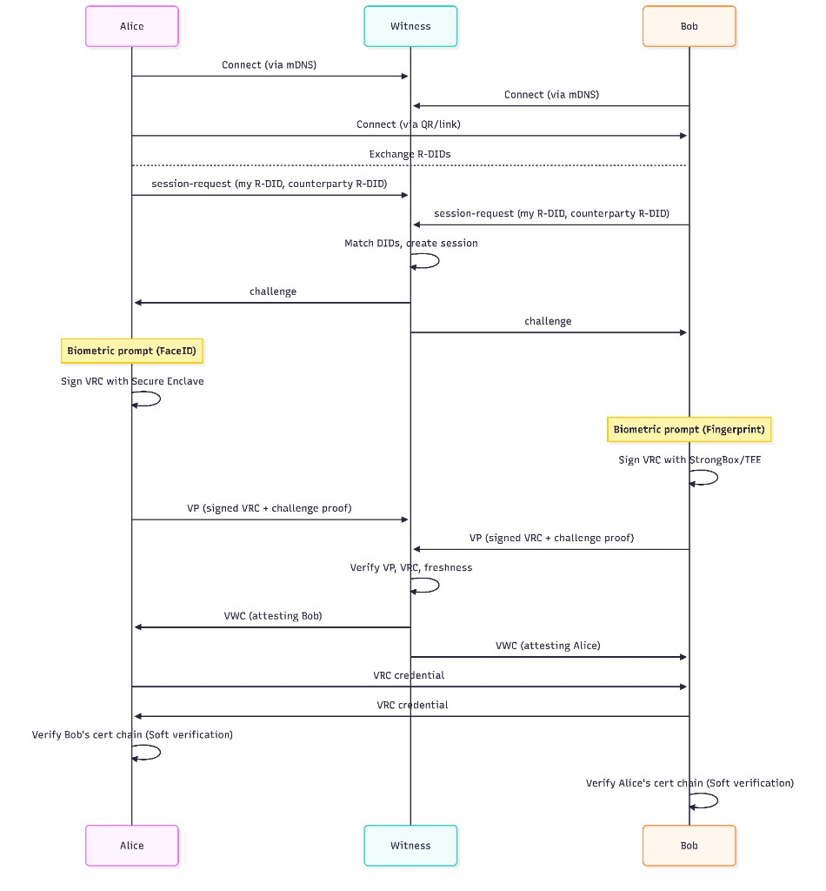
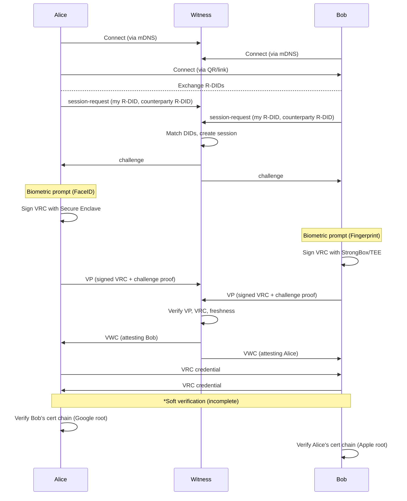

# Witnessed VRC Exchange Flow

A peer-to-peer credential exchange with third-party witness attestation and hardware-backed biometric proof.

## Participants

| Party | Role |
|-------|------|
| **Alice** | Mobile wallet (iOS/Android) |
| **Bob** | Mobile wallet (iOS/Android) |
| **Witness** | Local server that attests the exchange occurred |

## Credentials Produced

| Credential | Issuer | Purpose |
|------------|--------|---------|
| **VRC** (Verifiable Relationship Credential) | Each peer issues to the other | Proves relationship between two DIDs |
| **VWC** (Witnessed Verifiable Credential) | Witness server | Third-party attestation that exchange occurred |

## Flow Diagram

Mermaid source

## Verification Layers

### Witness Server Verifies (before issuing VWC):

| Check | What it verifies |
|-------|------------------|
| **Context** | VP challenge/domain matches session |
| **Identity** | VRC signature matches claimed R-DID |
| **Freshness** | VRC issued within time window |

*Note: Witness does NOT verify hardware certificates - it only notes if attestation evidence is present.*

### Mobile App Verifies (when receiving VRC):

| Check | What it verifies |
|-------|------------------|
| **Certificate Chain** | Roots to Apple/Google attestation CA |
| **Signature** | Hardware signature over VRC content is valid |

⚠️ *Note: Certificate verification is currently **soft verification** (not fully complete - no revocation checks, limited chain validation).*

## Hardware Attestation

Each VRC includes evidence proving biometric approval:

| Platform | Key Storage | Biometric | Root CA |
|----------|-------------|-----------|---------|
| iOS | Secure Enclave | FaceID/TouchID | Apple App Attestation |
| Android | StrongBox/TEE | Fingerprint | Google Hardware Attestation |

## Result

After the flow, each wallet has:
- **1 VRC** from the other party (proves the relationship)
- **1 VWC** from the witness (third-party attestation)
- **Hardware evidence** in both credentials (proves biometric approval)
